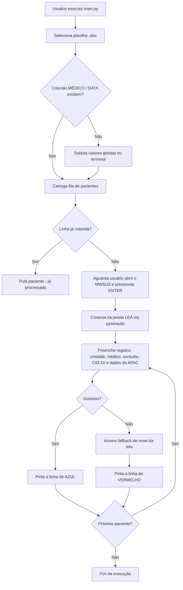

# OpenLEA

<p align="center">
  <b>Automação (RPA) para emissão em lote de LEA/APAC no módulo SUS do PIXEON SMART (MWSUS)</b>
</p>

<p align="center">
  
  
  
  
  
  
  
</p>

<p align="center">
  <a href="#-sobre-o-projeto">Sobre</a> •
  <a href="#-como-funciona">Como funciona</a> •
  <a href="#-pr%C3%A9-requisitos">Pré-requisitos</a> •
  <a href="#-instala%C3%A7%C3%A3o">Instalação</a> •
  <a href="#-formato-da-planilha">Planilha</a> •
  <a href="#-uso">Uso</a> •
  <a href="#-configura%C3%A7%C3%A3o">Configuração</a> •
  <a href="#-testes">Testes</a> •
  <a href="#-avisos-importantes">Avisos</a>
</p>

---

## 📋 Sobre o projeto

**OpenLEA** é um robô de automação de interface (RPA) escrito em Python que preenche, em lote, o formulário **LEA — Laudo para Emissão de APAC** dentro do sistema **PIXEON SMART / Módulo SUS (MWSUS)**, utilizado por unidades de saúde para faturamento e emissão de Autorização de Procedimento Ambulatorial de Alta Complexidade (APAC).

O robô lê uma fila de pacientes a partir de uma planilha Excel, controla a interface do MWSUS via **UI Automation** (`pywinauto`) preenchendo os campos necessários (registro, médico, consulta, datas, CID-10, motivo de cobrança), e devolve o resultado diretamente na planilha, **pintando cada linha de azul (sucesso) ou vermelho (falha)** — funcionando como um log visual e um checkpoint de retomada.

Foi construído para o fluxo de uma **unidade de oftalmologia** (`HOSPITAL OFTALMO PE`), com CID-10 e parâmetros de APAC fixos em código — veja [Configuração](#-configuração) para adaptar a outros contextos.

## ⚙️ Como funciona



## ✨ Funcionalidades

- 📂 **Seleção de planilha via diálogo nativo do Windows** — sem precisar editar código para apontar o arquivo.
- 🧠 **Verificação inteligente de colunas** — se `MÉDICO` ou `DATA` não existirem na planilha, o robô pergunta os valores uma única vez e aplica ao lote inteiro.
- 🔗 **"Arrasto" de células mescladas** — médico e data são propagados para as linhas seguintes até encontrar um novo valor, replicando o comportamento de células mescladas do Excel.
- ✅ **Log visual direto na planilha** — linhas processadas ficam azuis (sucesso) ou vermelhas (falha), permitindo pausar e retomar a execução sem reprocessar pacientes.
- 🔄 **Fallback automático de erro** — em caso de falha durante o preenchimento, o robô tenta resetar a tela do MWSUS (`F9`, `F4`) para seguir com o próximo paciente sem travar o lote.
- 🖥️ **Automação via UI Automation (`pywinauto`)** — não depende de coordenadas de tela fixas, e sim da árvore de controles da aplicação.

## 🧰 Pré-requisitos

| Requisito | Detalhe |
|---|---|
| Sistema operacional | Windows (obrigatório — depende de `pywin32` / UI Automation) |
| Python | 3.9 ou superior |
| Aplicação alvo | PIXEON SMART — Módulo SUS (MWSUS) instalado e acessível |
| Planilha | Arquivo `.xlsx` com, no mínimo, as colunas `REG` e `CONSULTA` |

## 📦 Instalação

```bash
git clone https://github.com/vileondev/OpenLEA
cd OpenLEA
python -m venv .venv
.venv\Scripts\activate
pip install -r requirements.txt
```

## 📑 Formato da planilha

O robô procura as seguintes colunas no cabeçalho (linha 1), sem diferenciar maiúsculas/minúsculas:

| Coluna | Obrigatória | Aliases aceitos | Descrição |
|---|---|---|---|
| `REG` | ✅ Sim | — | Número de registro/prontuário do paciente |
| `CONSULTA` | Recomendada | — | Código/valor da consulta associada |
| `MÉDICO` | Opcional* | `MEDICO` | Nome do médico responsável |
| `DATA DE VALIDADE` | Opcional* | `VALIDADE`, `DATA` | Data de validade da APAC (aceita data do Excel, número serial ou texto `ddmmaaaa`) |

\* Se `MÉDICO` e/ou `DATA` não existirem na planilha, o robô solicita os valores no terminal e os aplica a todas as linhas sem valor próprio.

**Legenda de cores aplicadas automaticamente (colunas A–F da linha):**

| Cor | Significado |
|---|---|
| 🟦 Azul | Paciente processado com sucesso |
| 🟥 Vermelho | Falha no processamento (revisar manualmente) |
| ⬜ Sem cor | Ainda não processado — entra na fila na próxima execução |

## ▶️ Uso

1. Deixe o **MWSUS aberto** na tela principal (o robô conecta na janela existente, ele não abre o sistema sozinho).
2. Execute o robô:
   ```bash
   python main.py
   ```
3. Selecione a planilha `.xlsx` de pacientes na janela que abrir.
4. Se solicitado, informe o médico e/ou a data padrão do lote.
5. Pressione `ENTER` no terminal quando o MWSUS estiver na tela inicial da LEA.
6. Acompanhe o progresso pelo terminal — a planilha é atualizada (colorida) em tempo real, paciente a paciente.

> 💡 Como o status fica gravado na própria planilha, é seguro interromper a execução (`Ctrl+C`) e rodar novamente depois: pacientes já coloridos são pulados automaticamente.

## 🔧 Configuração

Parâmetros globais ficam centralizados em [`config.py`](config.py):

```python
TITULO_MWSUS = "PIXEON SMART - PIXEON MEDICAL SYSTEM - Módulo SUS"

COR_SUCESSO = "FF00B0F0"  # Azul
COR_FALHA   = "FFFF0000"  # Vermelho

PAUSA_CURTA = 0.5
PAUSA_MEDIA = 1.5
PAUSA_LONGA = 3.0
```

Já os parâmetros **específicos do fluxo clínico** (unidade, CID-10, motivo de cobrança e código AP da APAC) estão fixos em [`rpa_core.py`](rpa_core.py) e precisam ser ajustados no código-fonte para outras unidades/especialidades:

| Parâmetro | Valor atual | Local |
|---|---|---|
| Unidade | `HOSPITAL OFTALMO PE` | `rpa_core.py` |
| CID-10 | `H409` | `rpa_core.py` |
| Motivo de cobrança | `52` | `rpa_core.py` |
| Código AP da APAC | `21` | `rpa_core.py` |

Se os tempos de espera (`PAUSA_*`) forem insuficientes para a sua máquina/rede, ajuste-os em `config.py` antes de rodar um lote grande.

## 🧪 Testes

A camada de leitura/escrita de planilha ([`excel_logger.py`](excel_logger.py)) tem cobertura de testes automatizados com `pytest` — o RPA em si (`rpa_core.py`) depende de uma janela real do MWSUS e não é testado unitariamente.

```bash
pip install -r requirements-dev.txt
pytest
```

A suíte cobre, entre outros cenários:

- Detecção de colunas ausentes/alias (`MÉDICO`/`MEDICO`, `DATA`/`VALIDADE`/`DATA DE VALIDADE`);
- Fila pulando linhas sem `REG` e linhas já coloridas (processadas);
- "Arrasto" de médico/data para linhas com células vazias (simulando mesclagem);
- Conversão de data em `datetime`, número serial do Excel e string com separadores;
- Erro (`ValueError`) quando não é possível determinar médico/data de uma linha;
- Coloração correta (azul/vermelho) e restrita às colunas A–F em `registrar_status`.

## 🗂️ Estrutura do projeto

```
OpenLEA/
├── main.py               # Ponto de entrada: seleção de planilha, loop de pacientes, orquestração
├── rpa_core.py            # Automação de UI (pywinauto) — conexão e preenchimento da tela LEA
├── excel_logger.py        # Leitura/validação da planilha e gravação do log colorido
├── config.py              # Parâmetros globais (título da janela, cores, tempos de espera)
├── requirements.txt       # Dependências de execução
├── requirements-dev.txt   # Dependências de desenvolvimento (inclui pytest)
├── pytest.ini             # Configuração do pytest
└── tests/
    └── test_excel_logger.py
```

## ⚠️ Avisos importantes

- **Dados de saúde**: as planilhas processadas contêm dados de pacientes. Trate os arquivos com o mesmo cuidado exigido para dados sensíveis/sigilo médico (LGPD), evitando versioná-los ou compartilhá-los fora do ambiente controlado.
- **Automação de UI é frágil por natureza**: mudanças de versão, layout ou idioma no PIXEON SMART podem quebrar o fluxo de preenchimento. Sempre valide um lote pequeno antes de rodar em produção.
- **Sem tela de confirmação antes de gravar (F5)**: o robô grava os registros automaticamente na LEA. Revise os parâmetros fixos em `rpa_core.py` (unidade, CID-10, motivo de cobrança) antes de usar em outro contexto clínico.
- Projeto **não afiliado, endossado ou de propriedade da Pixeon** — é uma automação de terceiros que interage com a interface do sistema.

## 🛣️ Possíveis melhorias

- [ ] Externalizar unidade/CID-10/parâmetros de APAC para `config.py` (hoje fixos em `rpa_core.py`)
- [ ] Registrar log de execução em arquivo, além da coloração da planilha
- [ ] Suporte a múltiplas unidades/especialidades via arquivo de configuração
- [ ] Integração contínua (CI) rodando `pytest` a cada push/PR

## 🤝 Contribuindo

Contribuições são bem-vindas! Abra uma *issue* descrevendo o problema/sugestão ou envie um *pull request*:

```bash
git checkout -b feature/minha-melhoria
git commit -m "feat: descreva sua alteração"
git push origin feature/minha-melhoria
```

## 📄 Licença

Este projeto ainda **não possui uma licença definida**. Até que uma seja adicionada, todos os direitos são reservados ao autor. Se pretende reutilizar ou distribuir o código, entre em contato com o mantenedor do repositório.
