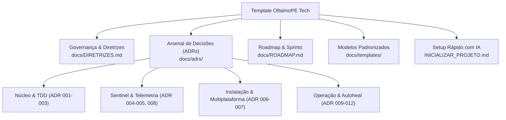

# 🗺️ Índice Geral de Documentação - OftalmoPE Tech

> **Guia Mestre de Navegação:** Este repositório é o **Template Oficial e Arsenal Arquitetural** da OftalmoPE Tech.  
> Qualquer novo projeto derivado deste modelo herda todas as decisões arquiteturais, padrões de segurança, fluxos de CI/CD e governança homologados em ambiente hospitalar real.

---

## 🧭 Mapa de Navegação Rápida

---

## 📚 1. Governança e Engenharia
* 📜 **[Diretrizes de Desenvolvimento e LGPD](DIRETRIZES.md):** Guia mandatório sobre TDD, BDD, LGPD (Zero PII), Git Flow, conventional commits e governança de Milestones no GitHub.
* 📋 **[Backlog Corporativo](BACKLOG.md):** Repositório de débitos técnicos, novas ideias e melhorias mapeadas para futuras iterações.
* 🤖 **[Skill de Governança para Agentes](../skills/oftalmope-governance/SKILL.md):** Manual executivo para modelos de IA atuarem de forma autônoma e disciplinada neste repositório.

---

## 🏛️ 2. Arsenal Arquitetural (ADRs Homologadas)
O catálogo completo de Architecture Decision Records com racional técnico, contexto e impactos está centralizado em **[`docs/adrs/index.md`](adrs/index.md)**:

| Categoria | ADR | Título Resumido |
| :--- | :--- | :--- |
| **Arquitetura Base** | [ADR-001](adrs/ADR-001-arquitetura-em-camadas.md) | Arquitetura em Camadas (SOLID / SRP: `core/`, `database/`, `services/`, `tests/`) |
| **Qualidade & Testes** | [ADR-002](adrs/ADR-002-qualidade-tdd-bdd-mutacao.md) | TDD Estrito, BDD/Gherkin, Cobertura 95%+ e Testes de Mutação (Mutmut) |
| **Segurança & Dados** | [ADR-003](adrs/ADR-003-conformidade-lgpd-zero-pii.md) | Conformidade LGPD Estrita, Mascaramento PII e Sanitização de Strings ($\le 250$ chars) |
| **SaaS & Licenças** | [ADR-004](adrs/ADR-004-licenciamento-handshake-killswitch.md) | Handshake com Admin Hub Sentinel, Token de Sessão e Kill-Switch com Grace Period |
| **Atualização** | [ADR-005](adrs/ADR-005-auto-updater-transparente.md) | Auto-Updater Transparente (1-Click) com Enforce de Versão Mínima e Download em Streaming |
| **Distribuição** | [ADR-006](adrs/ADR-006-distribuicao-multiplataforma-pyinstaller.md) | Empacotamento Standalone Multiplataforma (PyInstaller) para Windows e Linux |
| **Instalação** | [ADR-007](adrs/ADR-007-instalador-corporativo-caminhos-canonicos.md) | Diretório Canônico Per-User (`%LOCALAPPDATA%` / XDG) sem UAC e Atalhos Oficiais |
| **Resiliência** | [ADR-008](adrs/ADR-008-fila-offline-resiliente-e-ttl.md) | Fila Offline Permanente (`.json`), Reenvio Resiliente e Expurgo Automático TTL (5 Dias) |
| **Governança** | [ADR-009](adrs/ADR-009-gestao-de-sprints-fracionarias-e-milestones.md) | Gestão de Sprints com GitHub Milestones, Issues em Segundo Plano e Sprints Fracionárias |
| **Experiência Usuário** | [ADR-010](adrs/ADR-010-multi-sheet-session-loop.md) | Multi-Sheet Session Loop e Persistência de Terminal no Windows |
| **Auditoria Prévia** | [ADR-011](adrs/ADR-011-precheck-cadastral-e-caches-em-memoria.md) | Pre-Check de Integridade Cadastral com Caches em Memória e Telemetria de Triagem |
| **Inteligência** | [ADR-012](adrs/ADR-012-autoheal-de-procedimentos-e-aliases.md) | Autoheal de Procedimentos e Médicos com Dynamic Aliasing e Cache de Aprendizado Local |

---

## 🗺️ 3. Roadmap & Sprints
* 🎯 **[Roadmap Macro](ROADMAP.md):** Linha do tempo das sprints, objetivos de entrega e marcos contratuais.
* 📂 **[Índice de Sprints](sprints/index.md):** Diretório consolidado de todas as especificações de sprint e entregas.

---

## 📝 4. Modelos e Templates Oficiais
Padronização de documentos para uso contínuo da equipe:
* 📄 **[Template de ADR](templates/TEMPLATE_ADR.md):** Estrutura padronizada para registrar novas decisões de arquitetura.
* 📄 **[Template de Sprint](templates/TEMPLATE_SPRINT.md):** Planejamento em BDD, micro-sprints e critérios de aceite.
* 📄 **[Template de Handout de Sessão](templates/TEMPLATE_HANDOUT_SESSAO.md):** Registro de passagem de bastão entre turnos e desenvolvedores.
* 📄 **[Template de Playbook Operacional](templates/TEMPLATE_PLAYBOOK_OPERACIONAL.md):** Roteiro de homologação e implantação no cliente.

---

## 🚀 5. Inicialização de um Novo Projeto
Consulte o arquivo raiz **[`INICIALIZAR_PROJETO.md`](../INICIALIZAR_PROJETO.md)** para o questionário de 5 perguntas e automação de setup via agente de IA.
