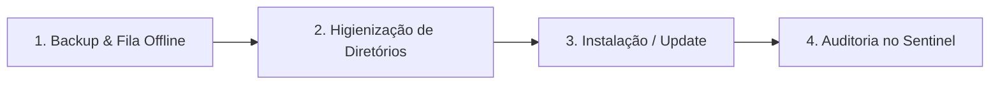

# 🛡️ Playbook Operacional de Implantação e Homologação - [NOME_DO_PROJETO]

> **Data / Hora de Entrada:** DD/MM/AAAA HH:MM BRT  
> **Unidade / Local:** Hospital de Olhos OftalmoPE - [Unidade / Cidade]  
> **Operador / Responsável:** [Nome do Faturista / Analista]  
> **Versão Homologada:** `vX.Y.Z`  
> **Status:** [ Em Homologação | Operação Assistida | Concluído com Êxito ]

---

## 🎯 Objetivo da Operação
[Descreva o objetivo da intervenção na estação de trabalho, ex: migração de máquina, instalação inicial limpa, atualização de versão ou homologação de novo lote clínico].

---

## 🗺️ Fluxo Executivo da Operação

---

## 📋 Checklist Passo a Passo

### Etapa 1: Salvaguarda de Dados Locais e Fila Offline
1. [ ] Verificar se existem lotes pendentes na fila local:
   - Caminho Windows: `%LOCALAPPDATA%\Programs\OftalmoPE\[NOME_DO_PROJETO]\logs\.sentinel_telemetry_queue.json`
   - Caminho Linux: `~/.local/share/oftalmope/[nome-projeto]/logs/.sentinel_telemetry_queue.json`
2. [ ] Fazer cópia de segurança (`.json.bak`) antes de qualquer intervenção;
3. [ ] Confirmar se há eventos `PENDING` para serem drenados na inicialização da nova versão.

### Etapa 2: Higienização da Área de Trabalho e Diretórios
1. [ ] Remover pastas desnecessárias de testes provisórios da Área de Trabalho;
2. [ ] Manter no Desktop **apenas** o atalho oficial:
   - Windows: `[NOME_DO_PROJETO].lnk`
   - Linux: `[NOME_DO_PROJETO].desktop`
3. [ ] Validar a integridade do arquivo `.env` corporativo no diretório canônico da aplicação.

### Etapa 3: Inicialização da Aplicação & Auto-Updater
1. [ ] Dar duplo-clique no atalho oficial;
2. [ ] Se houver nova versão disponível, aceitar a atualização 1-Click digitando `S` e pressionando ENTER;
3. [ ] Validar a barra de progresso em linha única e o reinício automático da aplicação;
4. [ ] Conferir o banner inicial: `[NOME_DO_PROJETO] vX.Y.Z — OFTALMO PE TECH`.

### Etapa 4: Auditoria e Validação no Sentinel Dashboard
1. [ ] Acessar `https://sentinel-oftalmope.onrender.com/dashboard/`;
2. [ ] Confirmar se o status da estação consta como **Online** com a versão atualizada;
3. [ ] Validar a ingestão dos laudos, cálculo de ROI e zeramento da fila de eventos `PENDING`.

---

## 🚨 Plano de Contingência / Rollback
Caso ocorra incompatibilidade operacional ou falha crítica de runtime:
1. Restaurar o executável anterior renomeando o arquivo de backup `.old`;
2. Restaurar o arquivo de configurações `.env` a partir do backup;
3. Notificar o time de engenharia com o log em `%LOCALAPPDATA%\Programs\OftalmoPE\[NOME_DO_PROJETO]\logs\`.
